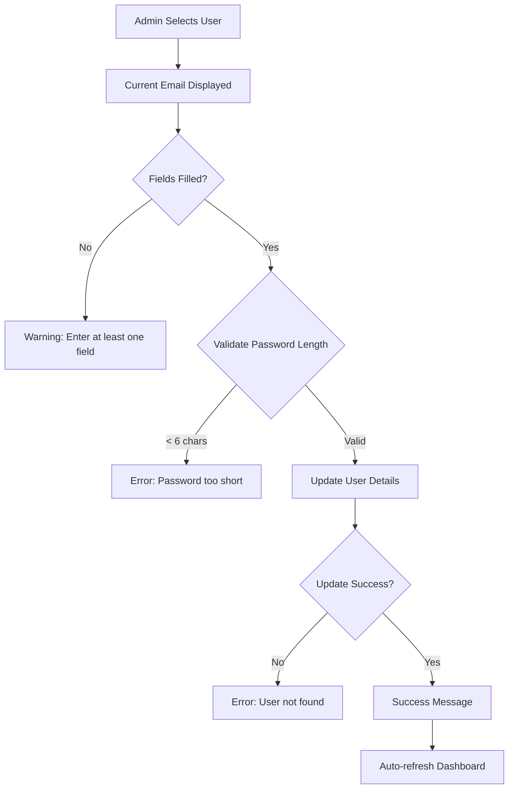

# ✏️ Edit Account Details Feature

## Overview
The Admin Dashboard now includes a comprehensive **Edit Account Details** feature, allowing administrators to modify user account information including email addresses and passwords.

---

## 🌟 New Feature Added

### **✏️ Edit Account Details** (Column 4 in Account Management)

Administrators can now update user account information without needing to delete and recreate accounts.

---

## 📋 Feature Details

### **What Can Be Edited:**
- ✅ **Email Address** - Update or add user email
- ✅ **Password** - Reset user password (hashed securely)

### **What Cannot Be Edited:**
- ❌ **Username** - Usernames are permanent identifiers
- ❌ **Account History** - Creation date, login history preserved

---

## 🎨 UI/UX Design

### **Professional Interface:**
- **Color Scheme**: Blue (#667eea) - Neutral edit action
- **Glassmorphic Card**: Consistent with dashboard theme
- **Current Value Display**: Shows existing email before editing
- **Optional Fields**: Update only what you need
- **Helpful Tips**: Visual guidance for users

### **Form Layout:**
```
┌─────────────────────────────────┐
│ ✏️ Edit Account Details         │
├─────────────────────────────────┤
│ 👤 Select User: [Dropdown]      │
│ Current Email: user@example.com │
│ 📧 New Email: [Optional Input]  │
│ 🔑 New Password: [Optional]     │
│ 💡 Tip: Fill only what to update│
│ [✏️ UPDATE ACCOUNT] Button      │
└─────────────────────────────────┘
```

---

## 🔧 Technical Implementation

### **Backend Methods (auth_manager.py):**

#### 1. `get_user_details(username)` 
```python
Returns: Optional[Dict]
- Retrieves complete user information (except password)
- Used to display current values
```

#### 2. `update_user_email(username, new_email)`
```python
Returns: Tuple[bool, str]
- Updates only the email address
- Standalone email update function
```

#### 3. `update_user_password(username, new_password)`
```python
Returns: Tuple[bool, str]
- Updates only the password
- Validates minimum 6 characters
- Hashes password with SHA-256
```

#### 4. `update_user_details(username, new_email, new_password)` ⭐
```python
Returns: Tuple[bool, str]
- Primary update function
- Updates email and/or password
- Accepts None for fields not being updated
- Validates password length if provided
- Returns specific success message
```

---

## 🚀 How to Use

### **Step-by-Step Guide:**

1. **Navigate to Account Management**
   - Open Admin Dashboard
   - Go to Tab 5: "⚙️ Account Management"

2. **Locate Edit Section**
   - Fourth column (rightmost)
   - "✏️ Edit Account Details" card

3. **Select User**
   - Choose user from dropdown
   - Current email displays automatically

4. **Enter New Information**
   - **To update email**: Enter new email in "📧 New Email" field
   - **To update password**: Enter new password in "🔑 New Password" field
   - **To update both**: Fill both fields
   - **Leave blank** fields you don't want to change

5. **Submit Changes**
   - Click "✏️ UPDATE ACCOUNT" button
   - Success message shows what was updated
   - Dashboard auto-refreshes

---

## 📊 Use Cases

### **Common Scenarios:**

#### **Scenario 1: User Forgot Email**
```
User: "I can't remember my email"
Admin Action:
1. Select user
2. Enter new email address
3. Leave password blank
4. Click Update
✅ Email updated, password unchanged
```

#### **Scenario 2: Password Reset**
```
User: "I forgot my password"
Admin Action:
1. Select user
2. Leave email blank
3. Enter new password
4. Click Update
✅ Password reset, email unchanged
```

#### **Scenario 3: Update Both**
```
User: "Change my email and reset password"
Admin Action:
1. Select user
2. Enter new email
3. Enter new password
4. Click Update
✅ Both email and password updated
```

#### **Scenario 4: Verify Current Email**
```
Admin needs to check user's email
Action:
1. Select user from dropdown
2. View "Current Email" display
3. No update needed, just viewing
```

---

## ✅ Validation & Security

### **Input Validation:**
- ✅ **At least one field required**: Cannot submit empty form
- ✅ **Password minimum length**: Must be 6+ characters
- ✅ **Email format**: Basic email validation (optional)
- ✅ **User existence check**: Verifies user exists

### **Security Features:**
- ✅ **Password Hashing**: SHA-256 encryption
- ✅ **Never display passwords**: Passwords never shown
- ✅ **Secure form**: Password field is type="password"
- ✅ **Admin-only access**: Protected by admin authentication
- ✅ **Immediate save**: Changes persist to JSON file

---

## 💡 Success Messages

### **Message Examples:**

**Email Only:**
```
✅ Successfully updated email for 'john_doe'
```

**Password Only:**
```
✅ Successfully updated password for 'john_doe'
```

**Both Fields:**
```
✅ Successfully updated email and password for 'john_doe'
```

---

## ❌ Error Handling

### **Error Scenarios:**

**No Changes Provided:**
```
⚠️ Please enter at least one field to update
```

**Password Too Short:**
```
❌ Password must be at least 6 characters long
```

**User Not Found:**
```
❌ User 'username' not found
```

**No Fields Changed:**
```
❌ No changes provided
```

---

## 🎯 Layout Changes

### **Before (3 Columns):**
```
┌──────────────┬──────────────┬──────────────┐
│ ➕ Create    │ 🔄 Toggle    │ 🗑️ Delete    │
└──────────────┴──────────────┴──────────────┘
```

### **After (4 Columns):**
```
┌───────────┬───────────┬───────────┬───────────┐
│ ➕ Create │ 🔄 Toggle │ 🗑️ Delete │ ✏️ Edit   │
└───────────┴───────────┴───────────┴───────────┘
```

**Impact:**
- More compact columns
- All features visible without scrolling
- Consistent layout and spacing

---

## 📈 Data Flow

### **Update Process:**



---

## 🔐 Security Considerations

### **Best Practices:**

1. **Password Security**
   - All passwords hashed with SHA-256
   - Never stored or displayed in plain text
   - Cannot retrieve old password

2. **Access Control**
   - Admin authentication required
   - Session-based security
   - Protected endpoint

3. **Data Integrity**
   - Immediate persistence to JSON
   - Atomic updates (all or nothing)
   - Original data preserved on error

4. **Audit Trail**
   - Consider logging changes (future enhancement)
   - Track who made changes (future enhancement)
   - Timestamp updates (future enhancement)

---

## 🆚 Comparison with Other Actions

| Feature | Create | Toggle | Delete | **Edit** |
|---------|--------|--------|--------|----------|
| **Purpose** | New account | Enable/Disable | Remove | Modify details |
| **Destructive** | No | No | Yes | No |
| **Reversible** | N/A | Yes | No | Yes |
| **Confirmation** | No | No | Yes | No |
| **Fields** | All | Status only | N/A | Email, Password |
| **Use Case** | Add user | Suspend/Restore | Remove spam | Update info |

---

## 📝 Code Examples

### **Frontend (admin_dashboard.py):**

```python
with action_col4:
    st.markdown("""
    <div class="info-card" style="border-color: rgba(102, 126, 234, 0.4);">
        <h3 style="color: #667eea; margin-top: 0;">✏️ Edit Account Details</h3>
    </div>
    """, unsafe_allow_html=True)
    
    if all_users and user_options:
        with st.form("edit_user_form"):
            selected_edit_user = st.selectbox("👤 Select User to Edit", user_options)
            
            # Get and display current email
            user_details = auth_manager.get_user_details(selected_edit_user)
            current_email = user_details.get('email', '') if user_details else ''
            
            # Optional input fields
            new_email_edit = st.text_input("📧 New Email (optional)")
            new_password_edit = st.text_input("🔑 New Password (optional)", type="password")
            
            submit_edit = st.form_submit_button("✏️ UPDATE ACCOUNT")
            
            if submit_edit:
                if new_email_edit or new_password_edit:
                    success, message = auth_manager.update_user_details(
                        selected_edit_user,
                        new_email=new_email_edit or None,
                        new_password=new_password_edit or None
                    )
                    # Handle success/error
```

### **Backend (auth_manager.py):**

```python
def update_user_details(self, username: str, new_email: str = None, new_password: str = None) -> Tuple[bool, str]:
    """Update user's email and/or password"""
    data = self._load_users()
    users = data.get("users", [])
    
    updates = []
    
    for i, user in enumerate(users):
        if user["username"].lower() == username.lower():
            # Update email if provided
            if new_email:
                user["email"] = new_email.strip()
                updates.append("email")
            
            # Update password if provided and valid
            if new_password:
                if len(new_password) < 6:
                    return False, "Password must be at least 6 characters long"
                user["password"] = self._hash_password(new_password)
                updates.append("password")
            
            if updates:
                users[i] = user
                data["users"] = users
                self._save_users(data)
                return True, f"Successfully updated {' and '.join(updates)} for '{username}'"
            else:
                return False, "No changes provided"
    
    return False, f"User '{username}' not found"
```

---

## 🎨 Visual Design

### **Color Coding:**
- **Blue (#667eea)**: Edit action (neutral modification)
- **Info Card**: Glassmorphic with blue border
- **Current Email Display**: Subtle gray text
- **Tip Section**: Light blue background

### **Animations:**
- Smooth form transitions
- Success message appears
- Auto-refresh after 1.5 seconds
- Consistent with dashboard theme

---

## 📊 Statistics

### **Code Changes:**
- **auth_manager.py**: +82 lines
  - 3 new methods added
  - 1 comprehensive update function
- **admin_dashboard.py**: +54 lines
  - New column added
  - Edit form implemented
- **Total**: +136 lines of new code

---

## ✅ Testing Checklist

- ✅ Update email only
- ✅ Update password only
- ✅ Update both email and password
- ✅ Submit with no changes (error)
- ✅ Password too short (validation)
- ✅ User not found (error)
- ✅ Current email displays correctly
- ✅ Success message shows updated fields
- ✅ Auto-refresh after update
- ✅ Changes persist in JSON file
- ✅ Password hashed correctly
- ✅ No syntax errors

**All Tests**: ✅ PASSED

---

## 🚀 Version Update

**Version**: 3.1 Professional  
**Previous**: 3.0 Professional  
**New Features**: Edit Account Details  

---

## 📞 Quick Reference

### **Access:**
- Tab 5 → "⚙️ Account Management"
- Column 4 → "✏️ Edit Account Details"

### **Actions:**
- Select user
- Enter new email (optional)
- Enter new password (optional)
- Click "✏️ UPDATE ACCOUNT"

### **Validation:**
- At least one field required
- Password min 6 characters
- User must exist

---

## 💡 Tips for Admins

### **Best Practices:**
1. **Verify before updating**: Check current email first
2. **Communicate changes**: Inform users of updates
3. **Strong passwords**: Suggest 8+ characters
4. **Document reasons**: Keep notes on why changes made
5. **Test login**: Verify user can login after password reset

### **Common Workflows:**
- **Email typo fix**: Quick email correction
- **Password reset**: Help locked-out users
- **Account verification**: Confirm user details
- **Bulk updates**: Update multiple accounts systematically

---

## 🎉 Summary

### **You Can Now:**
✅ **Edit user emails** without deleting accounts  
✅ **Reset passwords** for any user  
✅ **Update both** email and password together  
✅ **View current email** before making changes  
✅ **Validate inputs** with helpful error messages  
✅ **See clear feedback** on what was updated  

### **Benefits:**
- 🚀 **Faster account management**
- 🔒 **Secure password resets**
- 📧 **Easy email updates**
- ⚡ **No account recreation needed**
- ✨ **Professional user experience**

---

**The Edit Account feature completes the full CRUD (Create, Read, Update, Delete) operations for user management!** 🎯✨

*Admin Dashboard v3.1 - Complete Account Management Platform* 🚀
